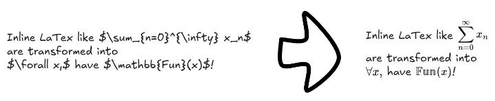

# What is it?

This repository contains a few script for the obsidian excalidraw plugin (https://github.com/zsviczian/obsidian-excalidraw-plugin)

# How to use?

Dowload the script you are interested in, and put in the folder `Excalidraw/Sript` of your vault

# Can I Help?

Sure! if you find a bug in a script you can contact me.

# Scripts

## Text To LaTeX

This scirpt allow you to go from `$...latex...$` in text element, to latex object
and conversly 

## Shiki Integration

This script allow you to give syntax highlighting to text elements.

It requires the plugin https://github.com/mProjectsCode/obsidian-shiki-plugin 

