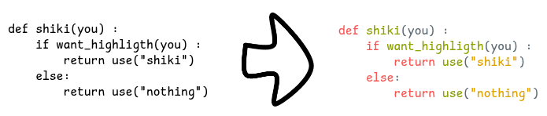

/*
Use the siki Highlighter plugin to add syntax highliting to text elements




Require https://github.com/mProjectsCode/obsidian-shiki-plugin installed

if one text element is selected:
- split it in small part with colors given by the current shiki config

if two or more elements selected:
- merge back the text elements into one single text


```js
*/

function copyStyleGlobal(element){
	if(!element) {
		return;
	}

	ea.style.strokeWidth = element.strokeWidth;
	ea.style.strokeStyle = element.strokeStyle;
	ea.style.strokeSharpness = element.strokeSharpness;
	ea.style.roughness = element.roughness;
	ea.style.fillStyle = element.fillStyle;
	ea.style.backgroundColor = element.backgroundColor;
	ea.style.strokeColor = element.strokeColor;

	if(element.type === 'text') {
		ea.style.fontFamily = element.fontFamily;
		ea.style.fontSize = element.fontSize;
		ea.style.textAlign = element.textAlign;
	}
}

// sort the elements el1 and el2 with a 
// somewhat intuitive sorting
function sortelems(el1, el2){
	let middle1 = el1.y + el1.height/2;
	let middle2 = el2.y + el2.height/2;

	if (middle1 > el2.y + el2.height || 
		(el2.y <= middle1 && middle1 <= el2.y + el2.height && el1.x >= el2.x)) {
		return 1; // el1 >= el2
	}
	return -1; // el1 < el2
}

// return true if we should add a '\n' between el1 and el2
function isLineBreak(el1, el2){
	let middle1 = el1.y + el1.height/2;
	let middle2 = el2.y + el2.height/2;
	return (middle1 > el2.y + el2.height ) || (middle2 > el1.y + el1.height);
}


const shiki = app.plugins.plugins["shiki-highlighter"];

if (!shiki || !shiki.highlighter){
    new Notice("error: can't load shiki plugin");
    return;
}

const elements = ea.getViewSelectedElements();
if (elements.length > 1 ){

///// syntax "unhighlight" part
///// copied from the text_to_latex script

let elToDelete = [];
let resultString = "";
let sortedEls = ea.getViewSelectedElements().sort(sortelems);
for (let i = 0; i < sortedEls.length; i++){
	const el = sortedEls[i];
	if (el.type === "text") {
		resultString += el.text;
		elToDelete.push(el);
		if (i+1 < sortedEls.length && isLineBreak(el, sortedEls[i+1])){
			resultString += "\n";
		}
    }
}

// choosing which style to apply
let aRandomText = sortedEls.find((el) => el.type === "text");
if (aRandomText != undefined){
	copyStyleGlobal(aRandomText);
    ea.style.strokeColor = "#000000";
}

if (resultString.length > 0) {
	ea.addText(sortedEls[0].x, sortedEls[0].y, resultString);
}

ea.deleteViewElements(elToDelete);
ea.addElementsToView();

////// end of the syntax "unhighlight" part

}else{

/////// syntax highlight part

const selected = elements[0];

if (!selected || !selected.type === "text"){
    new Notice("please select a text first");
    return;
}

copyStyleGlobal(selected);

const language = await utils.inputPrompt("language?", "String", "ocaml");
if (!language) return;
let y = selected.y;
let maxHeight = 0;
let x = selected.x;
let idTable = []; // table of elements to group

const highlight = await shiki.highlighter.getHighlightTokens(selected.text, language);
const tokens = highlight?.tokens;
if (!tokens?.length) {
    return;
}
for(const tokenline of tokens){
    for (const token of tokenline){
        ea.style.strokeColor = token.color;
        const id = ea.addText(x, y, token.content);
        idTable.push(id);
        x += ea.getElement(id).width;
        maxHeight = Math.max(ea.getElement(id).height, maxHeight);
    }
    if (tokenline.length == 0 && maxHeight > 0){ 
        // add a space to not forget there is an empty line
        const id = ea.addText(x, y, " ");
        idTable.push(id);
    }
    y += maxHeight;
    x = selected.x;
}

ea.addToGroup(idTable);
ea.deleteViewElements([selected]);
ea.addElementsToView();

}